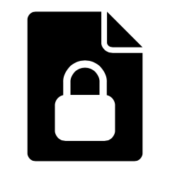

  
  <h1 align="center">EF加密工具</h1>
  
使用RSA2048和AES256加密文件(Windows)

\

# 描述
1. 采用标准的RSA2048和AES256加密算法。
2. 支持动态生成密钥对，也支持用户指定密钥对。
3. 抛开复杂的技术术语，一拖一放即可完成加解密。

# UI

  <kbd>
    
  </kbd>
  &nbsp;&nbsp;&nbsp;&nbsp;&nbsp;
  <kbd>
    
  </kbd>

# 使用说明
## 加密操作
1. 选择使用“临时密钥”，将为当前加密操作动态生成一个RSA2048密钥对，或者选择使用”固定密钥“，指定一个固定的RSA2048公钥；
2. 拖放一个文件到灰色矩形区域，选择“加密并保存”；
3. 加密结束后，程序将会自动打开一个文件管理器窗口，并定位到加密文件。
## 解密操作
1. 拖放加密文件(.data)和RSA2048私钥文件(.key)到灰色矩形区域，选择“解密并保存”；
2. 解密结束后，程序将会自动打开一个文件管理器窗口，并定位到解密文件。

# 反馈
我们非常期待听到您的声音。 
请通过点击“咨询与反馈”链接与我们联系。
