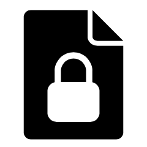

  
  <h1 align="center">EncryptFile</h1>
  
Encrypt file with RSA2048 and AES256(Windows)

\

# Description
1. EncrytFile use RSA2048 and AES256 to encrypt file.
2. It support generate dynamic RSA2048 key pairs, or use users RSA2048 key.
3. Dismiss complex technical terms, drag and release to encrypt or decrypt file.

# UI

  <kbd>
    
  </kbd>
  &nbsp;&nbsp;&nbsp;&nbsp;&nbsp;
  <kbd>
    
  </kbd>

# Instraction
## Encryption
1. Select using "Temporary Key" to use generate dynamic RSA2048 key pairs, or select "Personal Key" to use a fixed RSA2048 key pairs.
2. Drag one regural file into the gray area, and click "Encrypt and save" to encrypt file.
3. It will open exporer window and locate to the encrypted file after finish.
## Decryption
1. Drag encrypted(.data) file and RSA2048 private key(.key) file into the gray area, and click "Decrypt and save" to decrypt file.
2. It will open exporer window and location to the decrypted file after finish.

# Feedback
It's a pleasure to hear from you.
Please feel free to contact us by clicking the "Feedback" link.
